# NBIM Reconciliation - Multi-Agent Architecture

## Overview

This document describes the proposed multi-agent supervisor pattern for scaling the NBIM dividend reconciliation system from prototype to production.

## Architecture Diagram

## Agent Responsibilities

### 1. Data Validation Agent
**Type:** Rule-based
**Purpose:** Ensure data quality before reconciliation

- Parse and validate CSV structure
- Check for missing required fields (COAC_EVENT_KEY, ISIN, amounts)
- Normalize data formats (dates, currencies, decimals)
- Flag data quality issues (duplicate ISINs, negative amounts, etc.)
- **Output:** Clean, validated datasets ready for matching

### 2. Reconciliation Engine (Deterministic)
**Type:** Deterministic calculations
**Purpose:** Core break detection logic

- Match NBIM records to Custody records by COAC_EVENT_KEY + ISIN
- Calculate all discrepancies (quantity, amount, tax rate)
- Apply business rules (0.01% tolerance for rounding, split bookings)
- Generate structured break reports
- **Output:** List of breaks with precise numerical differences
- **Critical:** NO LLM involvement in calculations

### 3. Classification Agent
**Type:** LLM-powered
**Purpose:** Categorize and tag breaks

- Classify break types: QUANTITY, AMOUNT, TAX_RATE, MISSING_RECORD
- Tag relevant attributes (securities lending, FX-related, restitution, etc.)
- Identify compound breaks (multiple related issues)
- **Output:** Enriched breaks with category tags

### 4. Severity Assessment Agent
**Type:** LLM-powered with numerical context
**Purpose:** Prioritize breaks by business impact

- Calculate absolute financial impact (dollar amount at risk)
- Consider portfolio context (% of total position)
- Apply risk weighting based on:
  - Asset class (equities vs bonds)
  - Counterparty risk (custodian reliability)
  - Market conditions (volatile vs stable)
- Assign priority: CRITICAL, HIGH, MEDIUM, LOW
- **Output:** Severity-ranked breaks

**Human-in-the-loop triggers:**
- CRITICAL severity
- Financial impact > $100,000
- Confidence score < 0.7

### 5. Root Cause Analysis Agent
**Type:** LLM-powered with pattern recognition
**Purpose:** Identify why breaks occurred

- Cross-reference with historical break patterns
- Consider market events (ex-date changes, corporate actions)
- Identify systemic vs isolated issues
- Detect custodian-specific patterns
- **Output:** Most likely root cause with confidence score

**Human-in-the-loop triggers:**
- Novel break patterns not seen before
- Confidence < 0.6 on root cause

### 6. Remediation Advisor Agent
**Type:** LLM-powered with workflow knowledge
**Purpose:** Recommend specific actions

- Map break type to standard operating procedures
- Generate actionable items with assigned owners
- Estimate resolution timeframes
- Suggest preventive measures for future events
- **Output:** Detailed action plan with next steps

## Safeguards & Governance

### Human-in-the-Loop Decision Points

```mermaid
flowchart TD
    START[Break Detected] --> CALC[Reconciliation Engine<br/>Calculates Difference]
    CALC --> SEV{Severity<br/>Assessment}

    SEV -->|CRITICAL| HUMAN1[🚨 Human Review Required]
    SEV -->|HIGH + Impact > $100K| HUMAN1
    SEV -->|Confidence < 0.7| HUMAN1
    SEV -->|MEDIUM/LOW| AUTO[Automatic Processing]

    HUMAN1 --> APPROVE{Human<br/>Decision}
    APPROVE -->|Approve| AUTO
    APPROVE -->|Reject| OVERRIDE[Override LLM Assessment]
    APPROVE -->|Escalate| MANAGER[Operations Manager]

    AUTO --> ROOT[Root Cause Analysis]
    ROOT --> NOVEL{Novel<br/>Pattern?}
    NOVEL -->|Yes| HUMAN2[🚨 Human Review Required]
    NOVEL -->|No| REMEDY[Remediation Advisor]

    HUMAN2 --> LEARN[Update Pattern Database]
    LEARN --> REMEDY

    REMEDY --> FINAL[Action Plan Generated]
    FINAL --> AUDIT[Log to Audit Trail]
```

### Audit & Compliance Requirements

**Logging:**
- All LLM prompts and responses (verbatim)
- Timestamp and version for each agent invocation
- Human decisions and overrides
- Confidence scores for all LLM outputs

**Version Control:**
- Prompt templates in Git
- Model versions documented
- Agent configuration changes tracked

**Quality Metrics:**
- Track accuracy of severity assessments vs human judgment
- Monitor false positive/negative rates
- Measure time to resolution by break type
- Regular model revalidation (quarterly)

### Data Security

**PII Protection:**
- No personally identifiable information in LLM prompts
- Option to anonymize instrument names (use ISIN only)
- Custodian names can be hashed if needed

**Deployment Options:**
- **Cloud:** Anthropic/OpenAI APIs with DPA in place
- **On-premise:** Self-hosted LLM for sensitive environments
- **Hybrid:** Deterministic processing on-premise, LLM analysis in cloud

## Scaling Considerations

### From Prototype (3 events) to Production (8,000 events/year)

| Aspect | Prototype | Production |
|--------|-----------|------------|
| **Volume** | 3 events, 6 breaks | 8,000 events, ~5,000 breaks/year |
| **Processing** | Sequential, manual trigger | Batch processing, scheduled runs |
| **LLM Strategy** | Analyze every break | Smart sampling (auto-approve low-risk) |
| **Storage** | In-memory | PostgreSQL with audit tables |
| **Monitoring** | Manual review | Automated dashboards, alerts |
| **Cost** | ~$0.12/run | Budget cap: $1,000/month (~$0.10/event) |

### Optimization Strategies

**1. Smart Sampling**
- Auto-approve LOW severity breaks with confidence > 0.85
- Focus LLM analysis on HIGH/CRITICAL breaks
- Batch similar breaks for single LLM call

**2. Caching**
- Cache root cause analyses for identical break patterns
- Reuse remediation recommendations for recurring issues
- Store historical success rates by break type

**3. Rate Limiting**
- Set daily LLM call budget
- Queue non-urgent breaks for off-peak processing
- Prioritize CRITICAL breaks for immediate analysis

**4. Model Selection**
- Use GPT-4o-mini for classification/severity (fast, cheap)
- Use Claude Sonnet for complex root cause analysis
- Use GPT-4 only for novel/high-value cases

## Innovative Use Cases

### Beyond Break Detection

1. **Predictive Analytics**
   - Train on historical patterns to forecast high-risk events
   - Alert before discrepancies occur (ex-date mismatches, etc.)

2. **Natural Language Queries**
   - "Show me all Samsung dividend issues this quarter"
   - "What's the average resolution time for tax rate breaks?"

3. **Automated Communication**
   - Draft follow-up emails to custodians with break details
   - Generate variance explanations for regulatory reports

4. **Knowledge Base**
   - Build searchable repository of past resolutions
   - Create decision tree from historical remediation paths

5. **Training Simulator**
   - Generate realistic break scenarios for analyst onboarding
   - Provide instant feedback on trainee decisions

6. **Continuous Improvement**
   - Identify root causes that could be prevented upstream
   - Recommend process changes based on recurring patterns

## Technology Stack (Production)

## Risk Mitigation Summary

| Risk | Likelihood | Impact | Mitigation |
|------|------------|--------|------------|
| LLM hallucination on amounts | LOW | HIGH | Never let LLM calculate - only analyze |
| Model drift | MEDIUM | MEDIUM | Quarterly revalidation, human benchmarking |
| Over-reliance on AI | MEDIUM | HIGH | Mandatory human approval for CRITICAL |
| Cost explosion | MEDIUM | MEDIUM | Hard budget caps, rate limiting, caching |
| Data privacy breach | LOW | CRITICAL | On-premise option, strict PII policies, DPA |
| Prompt injection | LOW | LOW | Input sanitization, sandboxed execution |
| Audit compliance failure | LOW | HIGH | Comprehensive logging, immutable audit trail |

## Success Metrics

### Prototype Phase (Current)
- ✅ Processes 3 test events correctly
- ✅ LLM provides reasonable assessments
- ✅ Total cost < $1 per run
- ✅ Demo-ready without crashes

### Production Phase (12 months)
- 90% reduction in manual review time
- <5% false positive rate on severity
- 95% agreement with human analysts on prioritization
- Zero calculation errors (maintained through deterministic engine)
- <$0.10 LLM cost per event
- 99.9% uptime
- <2 hour average time to action on CRITICAL breaks

---

**Document Version:** 1.0
**Last Updated:** 2025-01-04
**Author:** Henrik Kvamme
**Status:** Design Complete - Ready for Implementation
