# Multi-Agent Architecture for NBIM Reconciliation
*For 8-Minute Interview Presentation*

---

## High-Level Architecture

```mermaid
graph TB
    %% Styling
    classDef human fill:#e1f5ff,stroke:#01579b,stroke-width:3px,color:#000
    classDef core fill:#e8f5e9,stroke:#1b5e20,stroke-width:3px,color:#000
    classDef llm fill:#fce4ec,stroke:#880e4f,stroke-width:3px,color:#000

    %% Main Components
    H[👤 Operations Team<br/>Human Oversight]:::human

    S[🎯 Supervisor Orchestrator<br/>Workflow Coordination]:::core

    D[📊 Data Validation Agent<br/>Parse & Normalize CSV]:::core

    R[🔢 Reconciliation Engine<br/>DETERMINISTIC CALCULATIONS<br/>Match records, detect breaks]:::core

    L1[🤖 Classification Agent<br/>Categorize break types]:::llm
    L2[⚠️ Severity Agent<br/>Risk assessment & prioritization]:::llm
    L3[🔍 Root Cause Agent<br/>Pattern analysis]:::llm
    L4[✅ Remediation Agent<br/>Action recommendations]:::llm

    A[📝 Audit Trail<br/>Complete logging]:::core

    %% Flow
    H -->|Upload CSV| S
    S --> D
    D --> R
    R -->|Breaks detected| L1
    L1 --> L2
    L2 --> L3
    L3 --> L4
    L4 --> S
    S -->|Results| H

    %% Audit
    R -.-> A
    L1 -.-> A
    L2 -.-> A
    L3 -.-> A
    L4 -.-> A

    %% Human in the loop
    L2 -.->|CRITICAL breaks<br/>$100K+ impact<br/>Confidence < 0.7| H
```

---

## Key Design Principles

### 1. **Separation of Concerns**
- **Deterministic calculations** = Reconciliation Engine (traditional code)
- **Intelligent analysis** = LLM Agents (AI-powered)
- **Never mix the two** ✅

### 2. **Human-in-the-Loop Safeguards**
- CRITICAL severity → Requires human approval
- Financial impact > $100K → Escalation
- Low confidence (< 0.7) → Manual review
- Novel patterns → Update training data

### 3. **Audit-First Architecture**
- Every LLM prompt/response logged
- Full traceability for compliance
- Version control on all prompts
- Historical accuracy tracking

---

## Agent Breakdown

| Agent | Type | Input | Output | Purpose |
|-------|------|-------|--------|---------|
| **Data Validation** | Rule-based | Raw CSV files | Clean datasets | Quality checks, normalization |
| **Reconciliation Engine** | Deterministic | NBIM + Custody data | List of breaks | Match records, calculate differences |
| **Classification** | LLM | Break details | Category tags | Identify break types, attributes |
| **Severity Assessment** | LLM | Categorized breaks | Priority level | Risk scoring, financial impact |
| **Root Cause Analysis** | LLM | Prioritized breaks | Probable causes | Pattern recognition, diagnosis |
| **Remediation Advisor** | LLM | Root causes | Action plan | Workflow mapping, recommendations |

---

## Scaling: Prototype → Production

### Current Prototype (Demo)
- **Volume:** 3 events, 6 breaks
- **Processing:** Sequential, manual trigger
- **Cost:** ~$0.12 per analysis
- **LLM Strategy:** Analyze everything

### Production Target (12 months)
- **Volume:** 8,000 events/year, ~5,000 breaks
- **Processing:** Automated batch processing
- **Cost:** <$0.10 per event ($1,000/month budget)
- **LLM Strategy:** Smart sampling
  - Auto-approve low-risk breaks (confidence > 0.85)
  - Focus LLM on HIGH/CRITICAL breaks
  - Cache repeated patterns

---

## Risk Mitigation

---

## Innovative Use Cases

### Beyond Break Detection

1. **Predictive Analytics** 📈
   - Forecast high-risk events before they occur
   - Alert on upcoming ex-dates with historical issues

2. **Natural Language Queries** 💬
   - "Show me all Samsung issues this quarter"
   - "What causes most tax rate discrepancies?"

3. **Automated Communication** ✉️
   - Draft follow-up emails to custodians
   - Generate regulatory variance explanations

4. **Knowledge Base** 📚
   - Searchable repository of past resolutions
   - Best practices from historical patterns

5. **Training Simulator** 🎓
   - Generate realistic scenarios for onboarding
   - Instant feedback on analyst decisions

6. **Process Improvement** 🔄
   - Identify preventable root causes
   - Recommend upstream system changes

---

## Why This Architecture Works

### ✅ Advantages

1. **Trust & Safety**
   - Calculations never delegated to LLM
   - Human oversight at critical points
   - Full audit trail for compliance

2. **Scalability**
   - Handles 8,000 events/year
   - No headcount increase needed
   - Cost-effective with smart sampling

3. **Continuous Learning**
   - Agents improve from human feedback
   - Pattern recognition gets better over time
   - Novel cases expand training data

4. **Operational Efficiency**
   - 90% reduction in manual review time
   - Consistent analysis (no human variability)
   - Faster time-to-resolution

### ⚠️ Challenges & Solutions

| Challenge | Solution |
|-----------|----------|
| Model drift over time | Quarterly revalidation, accuracy tracking |
| API rate limits | Queue management, priority system |
| False positives | Confidence thresholds, human validation loop |
| Context window limits | Batch similar breaks, summarization |

---

## Success Metrics

### Efficiency
- **Target:** 90% reduction in manual review time
- **Current:** 3 breaks → 2 minutes of analysis
- **Production:** 5,000 breaks/year → automated triage

### Accuracy
- **Target:** 95% agreement with human analysts
- **Measure:** Severity classification alignment
- **Validation:** Random sampling + quarterly audit

### Cost
- **Target:** <$0.10 per event
- **Budget:** $1,000/month for 8,000 events/year
- **Optimization:** Caching, smart sampling, model selection

### Quality
- **Target:** Zero calculation errors (maintained)
- **Measure:** Deterministic engine validation
- **Result:** 100% mathematical accuracy guaranteed

---

## Presentation Talking Points

### 1-Minute Version (Elevator Pitch)
*"We use a multi-agent architecture that separates deterministic calculations from AI-powered analysis. The Reconciliation Engine ensures perfect accuracy in break detection, while specialized LLM agents provide intelligent classification, risk assessment, and recommendations. Human oversight is built in at critical decision points, and everything is logged for compliance. This scales from 3 events to 8,000 per year while reducing manual review time by 90%."*

### Key Differentiators
1. **Hybrid approach:** Deterministic + AI (best of both worlds)
2. **Safety-first:** Human-in-the-loop for high-risk decisions
3. **Production-ready:** Clear path from prototype to 8,000 events/year
4. **Cost-effective:** <$0.10 per event with smart optimization

---

**Ready for 8-minute presentation** ✅
